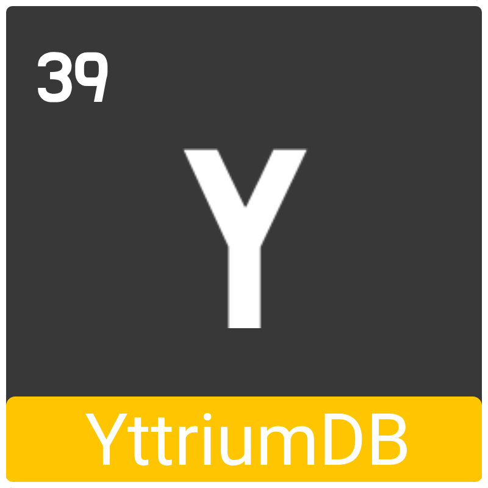

<div style="width: 100%;">
    <div style="transform: translate(50%, 0);">
        
    </div>
</div>

# YttriumDB

The YttriumDB is a simple and straightforward database that was created to store or load data quickly and lightweight. 

```
 🪶 Lightweight
 🚀 Fast
 🤙 Simple
```

### Architecture

The YttriumDB is a document-oriented database, which means that queries must always ask for a `column`. The database then returns a list of `rows`, all of which have a `key` and a `value`. 

|  |  |Loaded column ↓ |  |
| ------------- | ------------- | ------------- | ------------- |
|Column names → | **passwords**  | **emails** | **usernames** |
|Rows         ⬎ | ...  | "email1" : email1@example.com | ... |
| | ...  | "email2" : email2@example.com | ... |
| | ...  | "email3" : email3@example.com | ... |


### Installation

Basically, the installation of YttriumDB is extremely simple. First, the YttriumDB executable must be [downloaded](https://github.com/aredblock/YttriumDB/releases) and simply executed. The required workspace is created automatically and YttriumDB is started directly.To test if the database is responsive, you can call this URL: `http://localhost:46676/api/v1`, if this returns a JSON, with the name of the database, the API version and the API code name, the installation is successful and the YttriumDB is ready to use.

| Operating system | Tested |
| --- | --- |
| `Linux (Ubuntu LTS 24.04)` | ✅ |
| `Windows (Windows 11)` | ❎ |
| `MacOS (MacOS Catalina)` | ❎ |

### Why GoLang?

GoLang is a programming language that is particularly suitable for such programs. GoLang is built natively, but a GoLang .exe still has a garbage collector, which makes memory management particularly simple and scalable.
GoLang is also a language that is very easy to understand and program.

<br>

### Configuration

After the first start of YttriumDB, a file with the name config.json is created in the workspace folder.
In this file, settings for the database can be made in JSON format.

### Launch arguments

The YttriumDB configurations of ./config.json can be overwritten at startup via the start arguments. To do this, the name of the option must be placed after the name of the executable in small letters in this pattern: `--[name of option]=[value]`.

Example: `./yttriumDB --showkey=true`

### Build YttriumDB

To build the YttriumDB database yourself, you only need to execute the `./yttriumw.sh` script. After running it, you will find the executable for Linux, Windows and macOS in the ./build folder.

### Usage

The YttriumDB is intended for addressing via a provided API for the respective programming language you are using, and not for manual REST requests.

| Language  | API |
| ------------- | ------------- |
| `Java` | [YttriumDB-Java-API](https://github.com/aredblock/YttriumDB-Java-API) |
| `GoLang` | missing |
| `JS` | missing |
| `Python` | missing |
